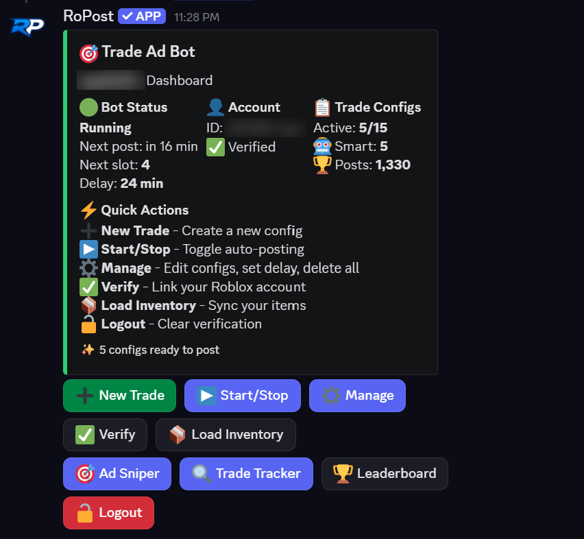
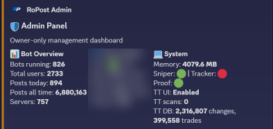
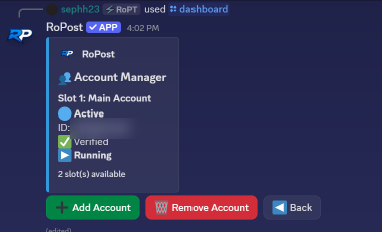
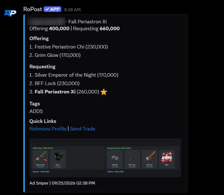
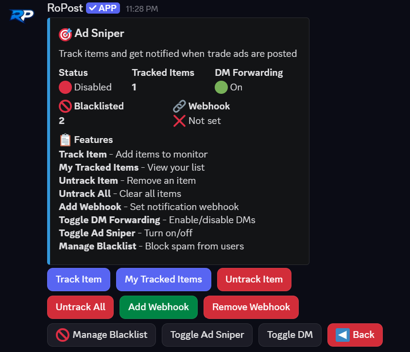
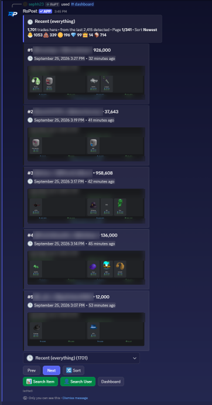
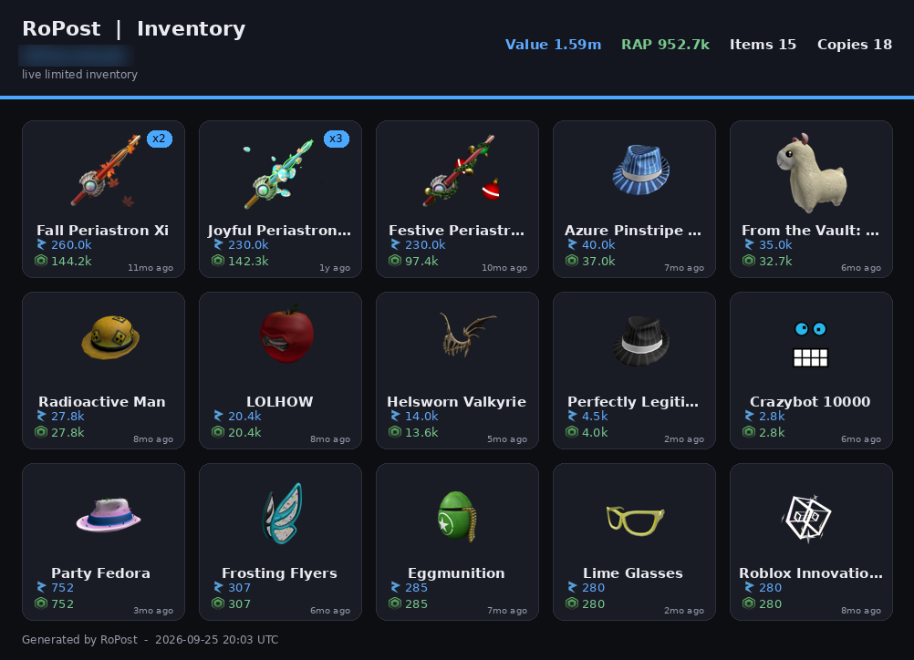
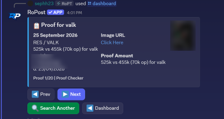
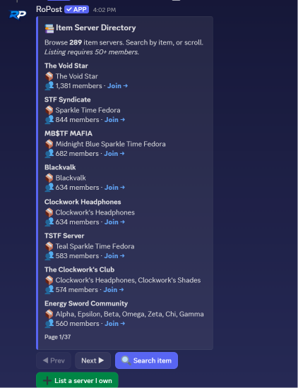

# RoPost

A Discord bot I built for Roblox limited item traders. It automates posting trade ads on [Rolimons](https://www.rolimons.com), snipes new ads the moment they match what you're looking for, and reconstructs completed trades from item ownership changes. It runs as a Discord service on a Linux VPS with 38 slash commands.

RoPost is a live product, so the source code is closed and not available to share. This is an overview with some screenshots and short code examples. Feel free to reach out if you have any questions, I'm happy to explain how it works or demo it.



## By the numbers

Straight from the admin panel:
- **2,700+ users**, with **800+ bots** posting at the same time
- **6.8 million+** trade ads posted
- In **750+** Discord servers
- The trade tracker has logged **2.3 million** ownership changes and rebuilt **~400,000 trades**



## Features

### Auto posting
- Post ads for up to 15 configured trades per Roblox account, each in one of three modes:
  - **Manual**: configure the exact items to offer/request
  - **Smart**: configure items to offer and have the bot pick the items to request based on some logic (ex: within an x-y% profit/loss range, above a certain demand threshold, downgrading if only 1 item is offered, upgrading if 2+ items are offered)
  - **Randomize**: have the bot pick 4 random items to offer from the user's inventory each time it posts an ad, with options to ignore items on hold and set a value range
- Trade ads can include Robux in the offer and tags for requested items, plus auto-bump, which deletes your last ad when it reposts so you don't stack duplicates
- Different delay between each post depending on the user (round-robin fashion), and it generates a preview image of the trade before posting
- Up to 3 Roblox accounts per Discord account, easy account switching, post trades for all accounts simultaneously
- Account verification through a phrase you enter in the Rolimons game to get the session cookie
- Trade poster runs every 25 sec, splits active users into 4 shards that process users concurrently
- Retries on temporary failures, retries with a different proxy on blocks, halts on expired login and sends a Discord DM



### Ad sniper
- View recent ads every ~5 sec using Rolimons' recent ads feed
- Track items being wanted (**requesting** mode) or offered (**offering** mode) by other people
- Generate an image of the other party's ad when it includes an item you're tracking, and send it to a configured webhook, DM, or both. Blacklist spammer accounts
- Ads seen previously are ignored, and the seen list is saved to disk so a restart does not ping users about ads they've been pinged about already. Ads are ignored if they're more than 3 minutes old

 

### Trade tracker
- Rolimons tracks item copy ownership but not who's been trading those copies. Trades are reconstructed based on who's gained/lost item copies (excerpt below)
- This happens in a separate scanning process which stores ownership to SQLite. Scanning frequency varies based on how active an item is
- Trade searching by item name, acronym, or ID. Pillow is used to draw a trade card showing what was traded and who won, and the card displays the items' values at the time they were traded
- Browsable feed of recent trades grouped by value. Very unbalanced trades are treated as transfers



### Low ad sniper
- `/lowad` finds newer traders that hold a couple decent limiteds but don't have too many ads up. Keeps track of leads daily, making it easier to find fresh leads each day

### Item and user search
- `/usersearch` for who owns specified items, `/matchowners` to find users that have a combination of items, `/invimage` to draw an image of any user's inventory



### Value proofs
- `/proof` command that looks for value proofs of items
- Proof screenshots are archived and processed to find out what items/values are shown using Gemini vision, with fallbacks including a rudimentary OCR/image matching system



### Access control
- Access is granted via user cards in the admin panel, and is given in month increments. More time can be given at any point, and months stack on top of current access duration
- Changes are reflected immediately, the posting process will DM a user and stop their bot when access runs out. Users are also DM'd when they're running low on time (3 days remaining), checked on an hourly basis

### Support and admin tools
- Ticket system for support. Each ticket gets its own channel. Buttons don't break on restarts. Staff cannot change a user's settings without their ok. Closing a ticket saves a transcript automatically
- Admin panel with many other miscellaneous features: bot usage stats, user lookup, force start/stop, manage bans, DM users, grant access, check status of proxies with automatic failover to backups, view recent errors, perform actions on multiple users, etc.

### Community
- A directory of trading servers that are application based and checked by staff, a leaderboard for most posts, and a tutorial on how to use the bot entirely within Discord



## Code excerpts

Short, trimmed pieces of the main systems. `...` marks where code was cut.

**Sharded posting loop.** Posting happens in a loop that runs every 25 seconds. It fetches all the users that have posting enabled and splits them into 4 shards, and the shards run in parallel. Previously this was all done in series and the problem was that if there were lots of users, the ones at the end of the user list would be posting several minutes late. Each shard does one big database read up front, and in order to keep the event loop responsive to button clicks etc., it yields control every 10 users:

```python
POSTING_SHARDS = 4

@tasks.loop(seconds=25)
async def posting_loop():
    _all_active = [uid for uid, active in list(bot_state.posting_tasks.items()) if active]
    if not _all_active:
        return
    _shards = [_all_active[i::POSTING_SHARDS] for i in range(POSTING_SHARDS)]  # every 4th user goes in each shard
    await asyncio.gather(*(_posting_pass(s) for s in _shards if s))


async def _posting_pass(active_user_ids):
    # one bulk db read for the whole shard instead of a bunch of queries per user
    snapshot = await asyncio.get_event_loop().run_in_executor(
        _POST_POOL, db.get_posting_loop_snapshot, active_user_ids
    )

    for _idx, user_id in enumerate(active_user_ids):
        # yield every 10 users so button clicks dont lag during a big pass
        if _idx and _idx % 10 == 0:
            await asyncio.sleep(0)
        ...
```

**Batched snapshot queries.** Each shard's state comes from a few database queries instead of several per user. User ids go into an `IN (...)` in chunks of 500, since SQLite has a limit to the number of query parameters that can be used. A `LEFT JOIN` is important here, to make sure users are not skipped if they don't have a record:

```python
CHUNK = 500
for i in range(0, len(user_ids), CHUNK):
    chunk = list(user_ids[i:i + CHUNK])
    ph = ",".join("?" * len(chunk))

    cur.execute(
        f"""
        SELECT us.user_id, us.player_id, us.post_delay_minutes, us.last_post_time, ...
        FROM user_settings us
        LEFT JOIN auth_tokens at ON at.user_id = us.user_id
        WHERE us.user_id IN ({ph})
        """,
        chunk,
    )
    ...
    cur.execute(f"SELECT user_id FROM banned_users WHERE user_id IN ({ph})", chunk)
    ...
```

**Shared rate limiter.** The poster, sniper, tracker, and searches all hit the same API, so I use a single rate limiter for them. It's just a token bucket, tokens get added at a fixed rate up to the burst size and each request takes a token. Since the bot is multithreaded, it has a lock, and provides an interface for use from a thread and an interface for use asynchronously:

```python
# token bucket: tokens refill at rps per second up to BURST and each request spends one
def _take(self):
    rps = self.rps()
    with self._lock:  # lock so two threads cant grab the same token
        now = time.monotonic()
        self._tokens = min(BURST, self._tokens + (now - self._last) * rps)
        self._last = now
        if self._tokens >= 1.0:
            self._tokens -= 1.0
            return 0.0
        return (1.0 - self._tokens) / rps

async def acquire_async(self):
    while True:
        wait = self._take()
        if wait <= 0:
            return
        await asyncio.sleep(min(wait, 5.0))
```

The allowed rate is defined in a small file, which gets reloaded every 30s, so it's easy to tweak the rate without restarting.

**Rebuilding trades from ownership changes.** Each transfer is a copy of an item that was given from one player to another at some time. Trades can be determined by grouping transfers based on the two players in sorted order and the second, since trades should result in transfers from player1->player2 and player2->player1 at the same time. Trimmed from the scanner:

```python
pair_timestamp_groups = defaultdict(lambda: {"a_to_b": [], "b_to_a": []})

for change_id, uaid, item_id, old_owner, new_owner, trade_ts in changes:
    timestamp = normalize_trade_timestamp(trade_ts)
    if timestamp is None or not (old_owner and new_owner):
        continue
    old_pid, new_pid = str(old_owner), str(new_owner)
    # sorted so a -> b and b -> a land in the same group
    player_a, player_b = sorted([old_pid, new_pid])
    direction = "a_to_b" if old_pid == player_a else "b_to_a"
    pair_timestamp_groups[(player_a, player_b, timestamp)][direction].append(
        {"uaid": uaid, "item_id": item_id}
    )

for (player_a, player_b, trade_ts), group in pair_timestamp_groups.items():
    # a_got is whatever moved b -> a, b_got is whatever moved a -> b
    a_got = dedupe(group["b_to_a"])
    b_got = dedupe(group["a_to_b"])
```

If the result of scanning has some transfers without any opposite transfers, or if some copies in a trade are still waiting on a timestamp, we store them as pending and check the players' inventories later to validate the transfers.

**Sniper dedupe that survives restarts.** To avoid re-pinging people after a restart, we maintain an `OrderedDict` of seen ads, and write it out roughly once per minute. The size of this is capped at 5000, and when new items are added and there are too many, the oldest are forgotten. Writing this file is done by writing to a temporary file then replacing the seen ads file with it, since a crash in the middle of writing could cause it to be corrupted:

```python
if ad_id in self._seen_ads:
    continue
self._seen_ads[ad_id] = True

# drop the oldest ids once we pass the cap so memory doesnt keep growing
while len(self._seen_ads) > self._MAX_SEEN:
    self._seen_ads.popitem(last=False)

...

# write to a .tmp first then swap it in so a crash mid write cant corrupt the file
tmp = SEEN_ADS_FILE.with_suffix(".tmp")
tmp.write_text(json.dumps(payload), encoding="utf-8")
tmp.replace(SEEN_ADS_FILE)
```

## How it's put together

```
                         Discord users
                               |
        discord_bot.py  (38 slash commands, buttons, modals, background loops)
       /          |            |              |               \
 posting loop  ad sniper   trade tracker   proof system   admin / tickets / access
 (bot_core)    (ad_sniper) (tracker_ui)    (proof_*)      (bot_ui, helper_panel)
       \          |            |              |               /
        database.py (SQLite, WAL)      ownership_scanner.py  <- its own process
                                               |
                                        ownership_db.py (snapshots + trade matching)
                               \              /
                    Rolimons + Roblox APIs (shared rate limiter)
```

Some decisions:
- **asyncio**: some operations can be done asynchronously, for example anything involving the network. Other operations need to be done in threads so they don't block the event loop, such as `requests`, rendering images, OCR
- **SQLite in WAL mode** so the posting loop can read while the UI writes. Each call opens its own short connection so nothing is shared across threads, and the hot paths use batched snapshot queries instead of a query per user
- **The ownership scanner runs in its own process** so heavy scanning never slows down ad posting
- **A shared token bucket rate limiter** for Rolimons requests, since every feature hits the same API
- **Discord interactions get deferred right away**, since Discord drops any interaction that isn't answered within 3 seconds
- **Hot reload** with `/reload` swaps UI modules without a restart, and member chunking is off at startup, so a full restart takes about 10 seconds instead of minutes

## Stack

Python, asyncio, discord.py, SQLite, aiohttp, curl_cffi, Pillow, Tesseract OCR, Gemini API, Linux VPS
